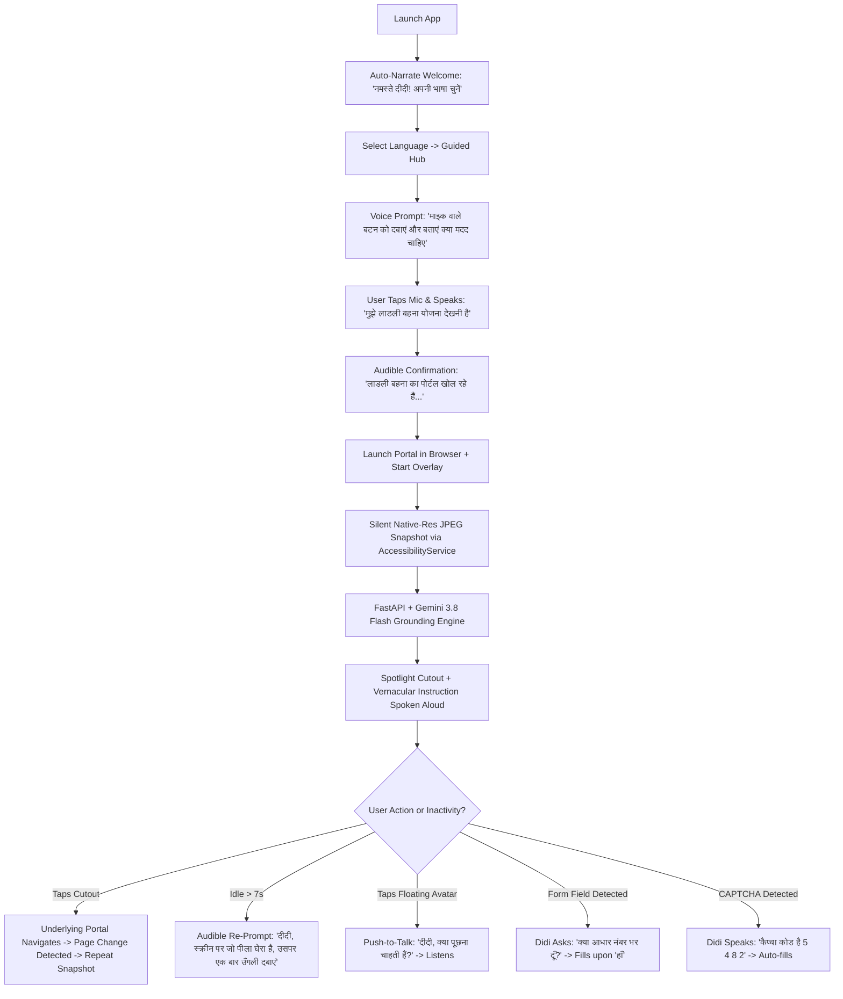
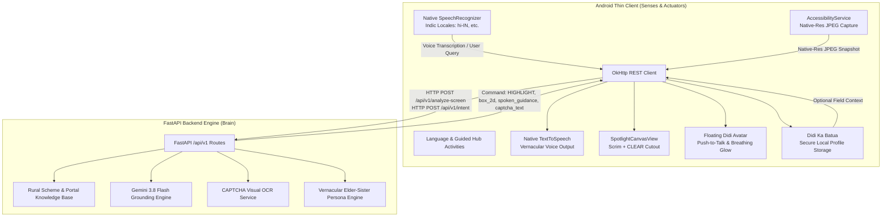

# Sahaayika (सहायिका) Implementation Plan: Distributed Client-Server Architecture

> **For agentic workers:** REQUIRED SUB-SKILL: Use superpowers:subagent-driven-development (recommended) or superpowers:executing-plans to implement this plan task-by-task. Steps use checkbox (`- [ ]`) syntax for tracking.

**Goal:** Build "Sahaayika" (सहायिका), a distributed AI-guided assistant empowering first-time rural smartphone users in India (specifically women with zero English literacy) to navigate public welfare portals via proactive audio guidance, real-time spotlight overlays, and automated voice assistance, powered by a Python FastAPI decision engine (Gemini 3.8 Flash via Google GenAI SDK) and a native Android thin client.

**Architecture:** Distributed Client-Server Architecture.
1. **Backend (Python FastAPI Brain):** Hosts the Gemini 3.8 Flash multimodal grounding pipeline, vernacular prompt engine (elder-sister persona), portal navigation state machine, CAPTCHA voice-reader, scheme catalog, and decision-making logic using the official `google-genai` SDK.
2. **Client (Native Android Senses & Actuators):** Lightweight native Android app (Kotlin, Min SDK 29, Target SDK 34) managing on-device sensors and UI overlay: AccessibilityService native-resolution JPEG screen snapshotting, native Indic STT/TTS audio execution, `WindowManager` overlay scrim with `PorterDuff.Mode.CLEAR` cutouts, local secure profile ("दीदी का बटुआ") for verbal autofill, and floating "दीदी" avatar with push-to-talk and breathing glow.
3. **Hackathon Compliance Guardrails:** Strict `.gitignore` keeping total repository size < 10 MB, single `main` branch policy, and deterministic verification.

**Tech Stack:** 
- **Backend:** Python 3.10+, FastAPI, Uvicorn, Google GenAI SDK (`google-genai` targeting Gemini 3.8 Flash), Pydantic v2, Pytest.
- **Client:** Kotlin, Android SDK 34 (Min SDK 29), ViewBinding, OkHttp 4, Android AccessibilityService, WindowManager Overlay, Android SpeechRecognizer & TextToSpeech.
- **Protocols:** REST (JSON + multipart/form-data for screen snapshots).

---

## 1. Design & UX Specifications (Grill-Me Alignment)

| UX Dimension | Decision & Implementation |
|---|---|
| **CAPTCHA & OTP Handling** | **Gemini CAPTCHA Voice-Reader + OTP Voice Transcribe:** When a government portal displays an image CAPTCHA, Gemini extracts the characters and speaks them aloud (*"कैप्चा कोड है: 5 4 8 2"*), offering 1-tap fill. For SMS OTPs, Android auto-reads the incoming OTP SMS or transcribes the user's spoken OTP with verbal confirmation. |
| **Overlay Voice Interaction** | **Hybrid Mode:** Proactive vernacular speech on page transition + 7-second inactivity watchdog voice nudges + **Push-to-Talk via tapping the floating 'दीदी' avatar** (prevents background noise false-triggers in busy rural homes/villages). |
| **Form Autofill ('दीदी का बटुआ')** | **Local Secure Profile:** User stores primary identifiers (Aadhaar, Samagra ID, Mobile Number) once. When an input field is highlighted, Didi audibly asks: *"दीदी, क्या मैं आपका आधार नंबर भर दूँ?"* and automatically fills/pastes it upon a verbal *"हाँ"* or 1 tap. |
| **Latency & Snapshot Compression** | **Native Resolution JPEG:** Snapshots captured at native screen resolution but compressed as JPEG (~250–400KB), preserving razor-sharp OCR for small portal fonts while ensuring sub-2-second roundtrip latency. The Didi avatar displays an animated breathing glow (*"दीदी सोच रही हैं..."*) during backend processing. |
| **Language Support** | **Hindi (`hi-IN`) as primary default**, with localized scheme names and prompts for **Tamil (`ta-IN`), Bengali (`bn-IN`), Telugu (`te-IN`), Marathi (`mr-IN`), and English (`en-IN`)**. |

---

## 2. In-Depth Workflow Specifications

### A. Audio-Only Workflow ("Helping Using Only Audio")
*Designed for women with zero reading literacy, visual impairment, or operating hands-free.*



---

## 3. System Architecture & Component Split



---

## 4. API Contract Specification (Client ↔ Backend)

### Endpoint 1: Intent & Scheme Resolver
- **Route:** `POST /api/v1/intent`
- **Request Body (JSON):**
  ```json
  {
    "query": "लाडली बहना",
    "language": "hi-IN"
  }
  ```
- **Response (JSON):**
  ```json
  {
    "scheme_id": "ladli_behna",
    "scheme_name": "मुख्यमंत्री लाडली बहना योजना",
    "portal_url": "https://cmladlibehna.mp.gov.in",
    "confirmation_speech": "लाडली बहना योजना का पोर्टल खोला जा रहा है।",
    "initial_prompt": "पेज लोड होने पर पीले घेरे को देखें।"
  }
  ```

### Endpoint 2: Multimodal Screen Grounding Engine (with CAPTCHA detection)
- **Route:** `POST /api/v1/analyze-screen`
- **Request Form-Data:**
  - `image`: Native-resolution JPEG file
  - `scheme_id`: "ladli_behna"
  - `language`: "hi-IN"
- **Response (JSON):**
  ```json
  {
    "action": "HIGHLIGHT",
    "box_2d": [312, 145, 420, 855],
    "spoken_guidance": "दीदी, नीचे पीले घेरे में 'आवेदन की स्थिति' बटन पर दबाएं।",
    "subtitle_text": "पीले घेरे में 'आवेदन की स्थिति' पर टैप करें",
    "field_type": "BUTTON",
    "captcha_code": null,
    "status": "IN_PROGRESS"
  }
  ```
  *(If an image CAPTCHA is detected on screen, `captcha_code` is populated with the decoded text and `spoken_guidance` informs the user).*

### Endpoint 3: Floating Didi Q&A Assistant
- **Route:** `POST /api/v1/didi/ask`
- **Request (JSON):**
  ```json
  {
    "user_query": "दीदी, अभी मुझे क्या करना है?",
    "language": "hi-IN"
  }
  ```
- **Response (JSON):**
  ```json
  {
    "spoken_answer": "दीदी, स्क्रीन पर जो पीला घेरा चमक रहा है, उसपर एक बार उँगली छूएं।",
    "subtitle_text": "पीले घेरे पर टैप करें"
  }
  ```

---

## 5. Hackathon Compliance Guardrails

| Hackathon Rule | Compliance Strategy |
|---|---|
| **Repository Size < 10 MB** | 1. Root `.gitignore` strictly excludes `.gradle/`, `build/`, `*.apk`, `*.aar`, `local.properties`, `__pycache__/`, `.venv/`, `.pytest_cache/`.<br>2. All icons will be lightweight XML Vector Drawables.<br>3. Continuous size tracking with `git count-objects -vH`. |
| **Public GitHub Repository** | Repo is public; no secret API keys committed. Secrets loaded from `.env` (gitignored). |
| **Only One Branch** | All work developed on `main`. |
| **Max 2 Submissions** | Comprehensive automated testing before submission (`pytest` + `./gradlew testDebugUnitTest`). |

---

## 6. File Structure & Component Layout

```
Hackathon/
├── .gitignore                          # Root gitignore keeping repo < 10 MB
├── README.md                           # Documentation & quickstart
├── LICENSE
├── docs/
│   ├── # Product Requirements & Implementa.txt
│   └── superpowers/plans/
│       └── 2026-10-01-sahaayika-development-plan.md
│
├── backend/                            # Python FastAPI Backend (Brain)
│   ├── requirements.txt
│   ├── .env.example
│   ├── app/
│   │   ├── __init__.py
│   │   ├── main.py                     # FastAPI entrypoint
│   │   ├── config.py                   # Settings & Gemini API key
│   │   ├── api/
│   │   │   ├── __init__.py
│   │   │   └── v1/
│   │   │       ├── router.py           # Aggregated v1 routes
│   │   │       ├── intent.py           # Intent resolver
│   │   │       ├── screen.py           # Screen grounding & CAPTCHA endpoint
│   │   │       └── didi.py             # Didi Q&A assistant
│   │   ├── services/
│   │   │   ├── gemini_client.py        # Gemini 3.8 Flash via google-genai SDK
│   │   │   ├── scheme_catalog.py       # Indic welfare scheme knowledge base
│   │   │   └── prompt_engine.py        # Vernacular elder-sister prompts
│   │   └── schemas/
│   │       ├── intent.py
│   │       └── screen.py
│   └── tests/
│       ├── test_intent.py
│       ├── test_scheme_catalog.py
│       └── test_screen_grounding.py
│
└── android/                            # Native Android App (Senses & Actuators)
    ├── build.gradle.kts
    ├── settings.gradle.kts
    ├── gradle.properties
    └── app/
        ├── build.gradle.kts
        ├── proguard-rules.pro
        └── src/
            ├── main/
            │   ├── AndroidManifest.xml
            │   ├── java/com/sahaayika/app/
            │   │   ├── SahaayikaApp.kt
            │   │   ├── data/
            │   │   │   ├── model/Models.kt
            │   │   │   ├── api/SahaayikaApiService.kt
            │   │   │   └── profile/DidiBatuaManager.kt
            │   │   ├── audio/
            │   │   │   ├── SpeechManager.kt
            │   │   │   ├── IndicSpeechRecognizer.kt
            │   │   │   └── IndicTextToSpeech.kt
            │   │   ├── service/
            │   │   │   ├── SpotlightOverlayService.kt
            │   │   │   └── SahaayikaAccessibilityService.kt
            │   │   └── ui/
            │   │       ├── language/
            │   │       │   ├── LanguageActivity.kt
            │   │       │   └── LanguageAdapter.kt
            │   │       ├── hub/
            │   │       │   ├── GuidedHubActivity.kt
            │   │       │   └── SchemeCardAdapter.kt
            │   │       └── overlay/
            │   │           ├── SpotlightCanvasView.kt
            │   │           ├── FloatingDidiAvatarView.kt
            │   │           └── SubtitleBannerView.kt
            │   └── res/
            │       ├── layout/
            │       │   ├── activity_language.xml
            │       │   ├── activity_guided_hub.xml
            │       │   ├── item_language.xml
            │       │   └── item_scheme_card.xml
            │       ├── values/
            │       │   ├── colors.xml
            │       │   ├── strings.xml
            │       │   └── themes.xml
            │       └── xml/
            │           └── accessibility_service_config.xml
            └── test/
                └── java/com/sahaayika/app/CoordinateTransformerTest.kt
```

---

## 7. Step-by-Step Implementation Tasks

### Phase 1: Repository Configuration & Hackathon Guardrails

#### Task 1: Root Git Configuration & Size Protection
**Files:**
- Create: `.gitignore`
- Create: `backend/requirements.txt`
- Create: `backend/.env.example`

- [ ] **Step 1: Write `.gitignore` with strict exclusion rules**
  Ignore all Gradle caches, Android `build/`, `.idea/`, `.apk`, `.aar`, Python `__pycache__`, `.venv`, `.pytest_cache`.
- [ ] **Step 2: Commit `.gitignore` and verify repo size remains < 1 MB**
  Run: `git count-objects -vH` and verify no unnecessary cache files are tracked.

---

### Phase 2: Python FastAPI Decision Engine (Brain)

#### Task 2: Backend Core, Schemas & Scheme Catalog
**Files:**
- Create: `backend/app/config.py`
- Create: `backend/app/schemas/intent.py`
- Create: `backend/app/schemas/screen.py`
- Create: `backend/app/services/scheme_catalog.py`
- Create: `backend/tests/test_scheme_catalog.py`

- [ ] **Step 1: Write failing test for Scheme Catalog**
  Verify lookup of "लाडली बहना", "pm kisan", "राशन कार्ड" returns correct portal URLs and localized titles.
- [ ] **Step 2: Implement Pydantic Schemas and Scheme Catalog**
  Define `IntentRequest`, `IntentResponse`, `ScreenAnalysisResponse`. Implement catalog with PM-Kisan, Ladli Behna, Ration Card, Ayushman, Janani Suraksha.
- [ ] **Step 3: Run pytest to verify pass**
  Run: `pytest backend/tests/test_scheme_catalog.py`
  Expected: PASS.

#### Task 3: Gemini 3.8 Flash Grounding Engine & CAPTCHA Reader
**Files:**
- Create: `backend/app/services/prompt_engine.py`
- Create: `backend/app/services/gemini_client.py`
- Create: `backend/tests/test_gemini_client.py`

- [ ] **Step 1: Write test with mock Gemini multimodal response**
  Test parsing of normalized bounding box `[ymin, xmin, ymax, xmax]`, vernacular spoken text, and CAPTCHA detection.
- [ ] **Step 2: Implement `prompt_engine.py` and `gemini_client.py` using `google-genai` SDK**
  Enforce elder-sister vernacular persona (no technical terms, max 12 words).
  Enforce strict JSON response schema:
  `{ "action": "HIGHLIGHT", "box_2d": [ymin, xmin, ymax, xmax], "spoken_guidance": "...", "subtitle_text": "...", "captcha_code": "..." }`.
- [ ] **Step 3: Run pytest to verify pass**
  Run: `pytest backend/tests/test_gemini_client.py`
  Expected: PASS.

#### Task 4: FastAPI Router & Endpoints
**Files:**
- Create: `backend/app/api/v1/intent.py`
- Create: `backend/app/api/v1/screen.py`
- Create: `backend/app/api/v1/didi.py`
- Create: `backend/app/api/v1/router.py`
- Create: `backend/app/main.py`
- Create: `backend/tests/test_api_endpoints.py`

- [ ] **Step 1: Write integration tests using FastAPI TestClient**
  Test `POST /api/v1/intent` and `POST /api/v1/analyze-screen`.
- [ ] **Step 2: Implement endpoints in FastAPI**
  Connect `intent`, `screen`, and `didi` routes to services. Add CORS middleware.
- [ ] **Step 3: Run pytest to verify pass**
  Run: `pytest backend/tests/test_api_endpoints.py`
  Expected: PASS.

---

### Phase 3: Android Native Thin Client (Senses & Actuators)

#### Task 5: Android Project Scaffolding
**Files:**
- Create: `android/settings.gradle.kts`
- Create: `android/build.gradle.kts`
- Create: `android/app/build.gradle.kts`
- Create: `android/gradle.properties`

- [ ] **Step 1: Configure Android build files**
  Configure AGP 8.3+, Kotlin 1.9+, Min SDK 29, Target SDK 34, ViewBinding, OkHttp 4, Kotlinx Serialization, Coroutines.
- [ ] **Step 2: Verify Android environment**
  Verify dependencies resolve cleanly.

#### Task 6: Data Models, Didi Batua (Secure Profile) & Coordinate Transformer
**Files:**
- Create: `android/app/src/main/java/com/sahaayika/app/data/model/Models.kt`
- Create: `android/app/src/main/java/com/sahaayika/app/data/profile/DidiBatuaManager.kt`
- Create: `android/app/src/main/java/com/sahaayika/app/data/api/SahaayikaApiService.kt`
- Create: `android/app/src/test/java/com/sahaayika/app/CoordinateTransformerTest.kt`

- [ ] **Step 1: Write Coordinate Transformer test**
  Verify formula converting 0–1000 scale to device screen pixels:
  `left = (xmin / 1000f) * screenWidth`, etc.
- [ ] **Step 2: Implement Models, DidiBatuaManager (Encrypted SharedPreferences), and OkHttp API Service**
  Implement `SahaayikaApiService` targeting FastAPI backend (`http://10.0.2.2:8000` for emulator).
- [ ] **Step 3: Run test to verify pass**
  Run: `CoordinateTransformerTest`
  Expected: PASS.

#### Task 7: Native Audio Engine (Speech-to-Text & Text-to-Speech)
**Files:**
- Create: `android/app/src/main/java/com/sahaayika/app/audio/IndicTextToSpeech.kt`
- Create: `android/app/src/main/java/com/sahaayika/app/audio/IndicSpeechRecognizer.kt`
- Create: `android/app/src/main/java/com/sahaayika/app/audio/SpeechManager.kt`

- [ ] **Step 1: Implement `IndicTextToSpeech`**
  Initialize `TextToSpeech` with regional locales (`hi-IN`, `bn-IN`, `ta-IN`, etc.). Provide completion callbacks.
- [ ] **Step 2: Implement `IndicSpeechRecognizer`**
  Initialize native `SpeechRecognizer` with `RecognizerIntent.EXTRA_LANGUAGE`. Provide RMS voice volume callbacks for mic pulsing visuals.
- [ ] **Step 3: Implement `SpeechManager` orchestrator**
  Manage state machine (`IDLE`, `LISTENING`, `PROCESSING`, `SPEAKING`). Ensure TTS and STT don't collide.

#### Task 8: Screen 1: Language Onboarding (`LanguageActivity`)
**Files:**
- Create: `android/app/src/main/res/layout/activity_language.xml`
- Create: `android/app/src/main/res/layout/item_language.xml`
- Create: `android/app/src/main/java/com/sahaayika/app/ui/language/LanguageAdapter.kt`
- Create: `android/app/src/main/java/com/sahaayika/app/ui/language/LanguageActivity.kt`

- [ ] **Step 1: Create Layouts**
  Clean, high-contrast, uncluttered layout with soft background `#FDFBF7`, large native script headers, vertical `RecyclerView`, and animated bouncing downward arrow banner (*"नीचे और भाषाएँ हैं"*).
- [ ] **Step 2: Implement Activity Logic**
  Auto-speak welcome greeting in Hindi/English on launch. On selection, save language and proceed to `GuidedHubActivity`.

#### Task 9: Screen 2: Guided Action & Intent Hub (`GuidedHubActivity`)
**Files:**
- Create: `android/app/src/main/res/layout/activity_guided_hub.xml`
- Create: `android/app/src/main/res/layout/item_scheme_card.xml`
- Create: `android/app/src/main/java/com/sahaayika/app/ui/hub/SchemeCardAdapter.kt`
- Create: `android/app/src/main/java/com/sahaayika/app/ui/hub/GuidedHubActivity.kt`

- [ ] **Step 1: Create Voice-First UI Layout**
  Large 130dp centered pulsating mic button, status banner (*"दीदी, बोलकर बताएं..."*), horizontal scheme cards, and bottom fallback text input.
- [ ] **Step 2: Connect Voice and Scheme Tap to Backend API**
  Auto-speak prompt on launch. Tapping mic activates `IndicSpeechRecognizer`. Recognized text is sent to `POST /api/v1/intent`. On response, speak confirmation, launch Chrome, and start `SpotlightOverlayService`.

#### Task 10: Screen 3: System Overlay, Custom Canvas, Floating Avatar & Inactivity Watchdog
**Files:**
- Create: `android/app/src/main/java/com/sahaayika/app/ui/overlay/SpotlightCanvasView.kt`
- Create: `android/app/src/main/java/com/sahaayika/app/ui/overlay/FloatingDidiAvatarView.kt`
- Create: `android/app/src/main/java/com/sahaayika/app/ui/overlay/SubtitleBannerView.kt`
- Create: `android/app/src/main/java/com/sahaayika/app/service/SpotlightOverlayService.kt`
- Create: `android/app/src/main/java/com/sahaayika/app/service/SahaayikaAccessibilityService.kt`
- Create: `android/app/src/main/res/xml/accessibility_service_config.xml`
- Modify: `android/app/src/main/AndroidManifest.xml`

- [ ] **Step 1: Implement `SpotlightCanvasView`**
  Custom View punching transparent cutout using `PorterDuffXfermode(PorterDuff.Mode.CLEAR)` and drawing a pulsing gold border.
- [ ] **Step 2: Implement `FloatingDidiAvatarView` (Push-to-Talk + Breathing Glow) & `SubtitleBannerView`**
  Draggable bubble snapping to edge; tapping activates push-to-talk to ask Didi questions (`/api/v1/didi/ask`). Glows while backend processes.
- [ ] **Step 3: Implement `SahaayikaAccessibilityService` & `SpotlightOverlayService`**
  Accessibility service triggers silent native-res JPEG `takeScreenshot()`, posts to FastAPI `/api/v1/analyze-screen`, updates overlay cutout, and speaks vernacular instructions. Window flags set to `FLAG_NOT_FOCUSABLE` and `FLAG_NOT_TOUCH_MODAL` so user taps pass directly through to Chrome.
  Includes 7-second inactivity timer that gently repeats guidance with simpler physical cues.
- [ ] **Step 4: Register all components & permissions in `AndroidManifest.xml`**
  `SYSTEM_ALERT_WINDOW`, `RECORD_AUDIO`, `INTERNET`, `FOREGROUND_SERVICE`, `BIND_ACCESSIBILITY_SERVICE`.

---

## 8. Verification Plan

### Automated Tests
1. **Backend Tests:**
   ```bash
   cd backend
   pytest tests/ -v
   ```
2. **Android Unit Tests:**
   ```bash
   cd android
   ./gradlew testDebugUnitTest
   ```
3. **Repository Size & Cleanliness Check:**
   ```bash
   git count-objects -vH
   ```
   *(Ensure size is strictly under 10 MB)*

### Manual End-to-End Verification
1. Start FastAPI backend: `uvicorn app.main:app --host 0.0.0.0 --port 8000 --reload`.
2. Launch Sahaayika on emulator (`Medium_Phone`).
3. Verify `LanguageActivity` speaks greeting aloud without any user touch.
4. Select Hindi -> Verify transition to `GuidedHubActivity`.
5. Speak "लाडली बहना" into mic -> Verify audio confirms and opens browser.
6. Verify overlay darkens the screen, punches a transparent hole over the target button with a pulsing gold border, and speaks the physical vernacular instruction aloud.
7. Tap the cutout -> Verify the tap passes through directly to Chrome.
8. Wait 7 seconds -> Verify the inactivity watchdog repeats the instruction with a simpler hint.
9. Tap the floating Didi avatar -> Verify push-to-talk activates, asking *"दीदी, क्या मदद चाहिए?"*.
